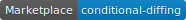

# path-filtering-action

[](https://github.com/marketplace/actions/path-filtering) 

A Github Action to filter paths based on git diff rules.

The step parses rules and runs `git diff` commands. A `DIFF_DETECTED` boolean environment variable is set based whether diff changes are found, which can then be reused to conditionally run subsequent steps.

## Usage

**1. Add a set of rules in a new `.github/rules.yml` file**

```
rules:
- paths:
  - ./src
```

**2. Update your workflow**

The `setup go` step uses `DIFF_DETECTED` to determine whether to run or not

```yml
steps:
- uses: actions/checkout@v2
  with:
    fetch-depth: 100
- uses: lostick/path-filtering-action@main
- name: setup go
  if: env.DIFF_DETECTED == 'true'
  uses: actions/setup-go@v2
```

## Configuration

Options supported in `rules.yml` config file

```yml
rules:
- paths: # required - pathnames passed to git diff
  - ./src
```

## Action Inputs

| Input | Description | Default |
| --- | --- | --- |
| `config_file` | Diff rules file path. Can be set to a different file each time you call the action | `.github/rules.yml` |
| `base_ref` | Base branch used by `git diff` command to compare the current branch's changes against | `main` |

## License

[MIT](./LICENSE)
